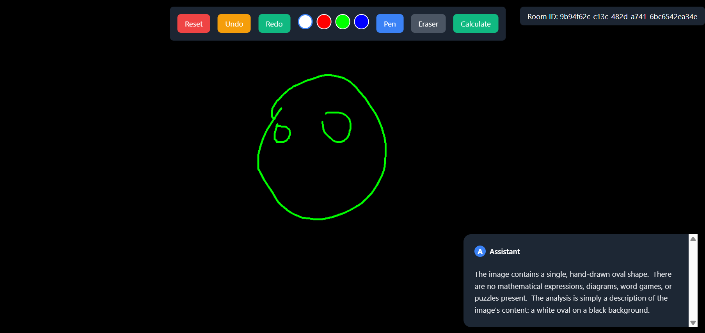
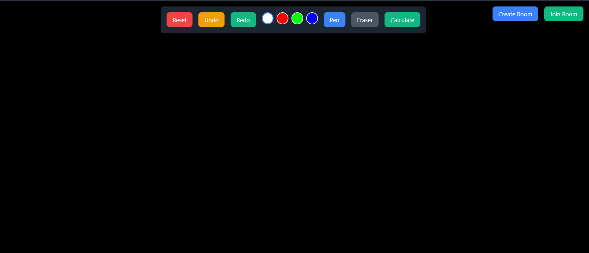

# AI-Powered Drawing Calculator 🎨

## Overview
An innovative full-stack web application that transforms hand-drawn questions into answers using AI. Draw mathematical equations, diagrams, or word puzzles on a digital canvas and receive instant solutions through Google's Gemini AI processing.


## ✨ Key Features

### Interactive Drawing Canvas
- Multi-color drawing tools
- Eraser functionality
- Undo/Redo capabilities
- One-click canvas reset

### Real-time Collaboration
- Create and join drawing rooms
- Live cursor tracking with user identification
- Real-time drawing synchronization
- Shared response viewing
- Active user status indicators

### AI-Powered Solutions
Processes hand-drawn:
- Mathematical equations
- Geometric problems
- Trigonometric questions
- Word puzzles
- Diagram-based queries


## 🛠️ Technologies Used

### Frontend
- React + Vite
- Tailwind CSS
- Socket.IO Client
- Radix UI Components

### Backend
- Node.js
- Express
- Socket.IO
- Google's Gemini AI API

## 🚀 Getting Started

### Prerequisites
- Node.js (v14 or higher)
- npm

### Installation

1. Clone the repository
```bash
git clone [repository-url]
```

2. Install Frontend Dependencies
```bash
cd frontend
npm install
```

3. Install Backend Dependencies
```bash
cd backend
npm install
```

4. Configure Environment Variables
Create a .env file in the backend directory:
```env
GEMINI_API_KEY=your_gemini_api_key
PORT=3000
```

## 🎯 Usage

1. Open the application in your browser
2. Enter your name when prompted
3. Create a new room or join an existing one
4. Use the drawing tools to write/draw your question
5. Click "Calculate" to receive AI-generated answers
6. Use the reset button to clear the canvas for new questions




## 🤝 Collaborative Features

### Real-time User Tracking
- See other users' cursors with their names
- Active/inactive status indicators
- Synchronized drawing updates
- Shared response viewing

### 🔐 Room Management
- Create private rooms
- Join existing rooms with room ID
- Leave room functionality with confirmation
- Automatic cleanup of disconnected users

## 🎨 Drawing Tools
- Multiple color options
- Eraser tool
- Undo/Redo functionality
- Full canvas reset
- Real-time drawing sync

## 🤖 AI Integration

Powered by Google's Gemini AI, processing:
- Mathematical calculations
- Geometric problems
- Word puzzles
- Diagram interpretations

## Contributing
Contributions are welcome! Please feel free to submit a Pull Request.

## License
This project is licensed under the MIT License - see the LICENSE file for details.

## Acknowledgments
- Google Gemini AI for powering the solution generation
- Radix UI for component library
- Socket.IO for real-time capabilities
